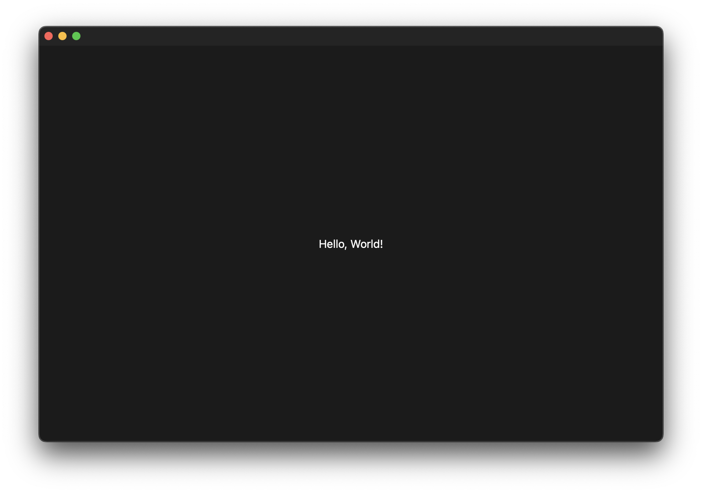

# The JRUI library

**JRUI** is a platform independent UI library for C++, inspired by SwiftUI



```cpp

#include <UI/Controller.h>
#include <UI/Window.h>

struct MainController : UI::Controller {
    UI::ViewRef body() override {
        return VStack(
            Text("Hello, World!")
        )
        .alignment(center)
        .sizing(fillArea);
    }
};

int main()
{
    auto controller = MainController();
    auto window = UI::Window()
        .controller(controller)
        .min_size(900, 600);
    window.run();
}

```

## Build instructions

### Setup:

```sh

meson build

```

### Build:

```sh

ninja -C build

```

### Run:

```sh

./build/examples/hello-world

```
